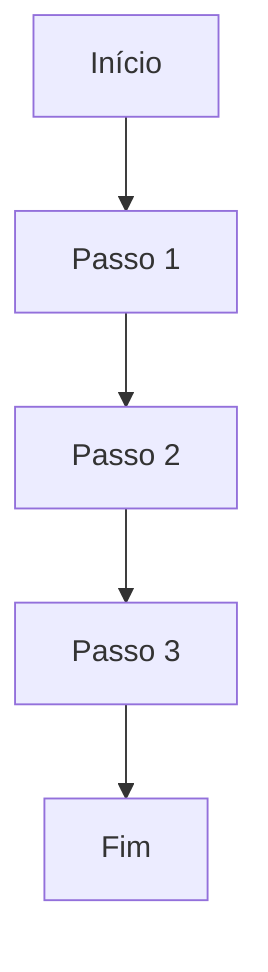
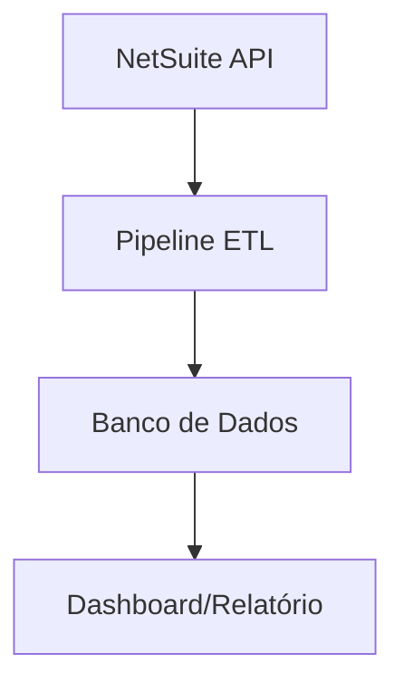
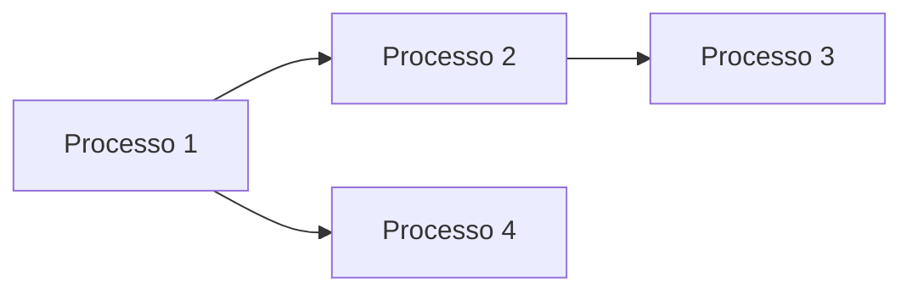

# Mapa de Processos - Área Comercial

**Última atualização:** 2026-01-26

---

## Índice de Processos
1. [[#Processo 1 - Nome do Processo]]
2. [[#Processo 2 - Nome do Processo]]
3. [[#Processo 3 - Nome do Processo]]

_(Adicionar mais processos conforme identificados)_

---

## Processo 1 - [Nome do Processo]

### Informações Gerais
- **Responsável:**
- **Frequência:** (diária/semanal/mensal)
- **Tempo estimado:**
- **Criticidade:** ⭐⭐⭐⭐⭐ (1-5 estrelas)
- **Status:** 🔴 Manual | 🟡 Semi-automático | 🟢 Automatizado

### Descrição
**O que é este processo?**

**Por que ele existe?**

### Fluxo Atual (AS-IS)

**Passo a passo detalhado:**
1.
2.
3.
4.

### Dados Envolvidos

**Entrada (Input):**
- Fonte:
- Formato:
- Campos necessários:

**Processamento:**
- Transformações aplicadas:
- Regras de negócio:
- Cálculos realizados:

**Saída (Output):**
- Destino:
- Formato:
- Destinatários:

### Dores Identificadas

**Problemas atuais:**
- ❌
- ❌
- ❌

**Gargalos:**
- 🚧
- 🚧

**Riscos:**
- ⚠️
- ⚠️

### Proposta de Automação (TO-BE)

**Solução proposta:**

**Fluxo automatizado:**

**Benefícios esperados:**
- ✅
- ✅
- ✅

**Esforço de implementação:**
- [ ] Baixo (1-2 semanas)
- [ ] Médio (3-4 semanas)
- [ ] Alto (1-2 meses)

### Requisitos Técnicos

**Acessos necessários:**
- [ ] NetSuite API
- [ ] ODBC/JDBC
- [ ] SharePoint
- [ ] Outro:

**Tecnologias:**
- [ ] Python
- [ ] Power BI
- [ ] Azure/AWS
- [ ] SQL
- [ ] Outro:

**Dependências:**

---

## Processo 2 - [Nome do Processo]

_(Copiar estrutura acima para cada novo processo)_

---

## Processo 3 - [Nome do Processo]

_(Copiar estrutura acima para cada novo processo)_

---

## Matriz de Priorização

| Processo | Impacto (1-5) | Esforço (1-5) | Prioridade | Status |
|----------|---------------|---------------|------------|--------|
| Processo 1 |  |  |  | 🔴 |
| Processo 2 |  |  |  | 🔴 |
| Processo 3 |  |  |  | 🔴 |

**Legenda de Prioridade:**
- 🔥 Crítico - Fazer primeiro
- ⭐ Alto - Próxima sprint
- 📋 Médio - Backlog próximo
- 💡 Baixo - Futuro

---

## Dependências entre Processos

---

## Observações Gerais

**Padrões identificados:**

**Oportunidades de integração:**

**Desafios comuns:**

---

#processos #mapeamento #automacao
