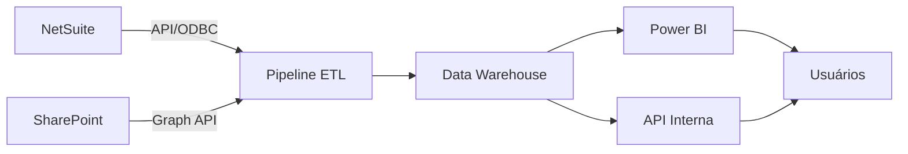

# Requisitos Técnicos - Projeto de Automação

**Última atualização:** 2026-01-26

---

## 1. Acesso a Sistemas

### 1.1 NetSuite (Oracle)

**Status de Acesso:**
- [ ] Acesso ao NetSuite liberado
- [ ] Credenciais obtidas
- [ ] Perfil de acesso adequado (Analytics, API, etc.)

**API e Integrações:**
- [ ] **SuiteTalk (Web Services)** - SOAP/REST API
  - Endpoint:
  - Account ID:
  - Consumer Key/Secret:
  - Token ID/Secret:
  - Documentação: https://docs.oracle.com/en/cloud/saas/netsuite/ns-online-help/chapter_1540391670.html

- [ ] **SuiteAnalytics Connect** - ODBC/JDBC
  - Driver instalado:
  - Connection String:
  - Schema:
  - Limitações conhecidas:

- [ ] **Saved Searches**
  - ID da busca "BASE VENDAS":
  - Outras buscas relevantes:

**Limitações:**
- Rate limits da API:
- Horários de manutenção:
- Restrições de dados:

---

### 1.2 Microsoft 365

**Status de Acesso:**
- [ ] Conta M365 criada/ativada
- [ ] Acesso ao SharePoint liberado
- [ ] Power BI licenciado
- [ ] Azure AD registrado (para APIs)

**Power BI:**
- [ ] Workspace criado:
- [ ] Capacidade: (Pro/Premium/Embedded)
- [ ] Gateway instalado (se on-premises):

**SharePoint/OneDrive:**
- [ ] Site principal:
- [ ] Bibliotecas de documentos relevantes:
  -
  -
- [ ] Permissões de leitura/escrita

**Microsoft Graph API:**
- [ ] App Registration criado
- [ ] Client ID:
- [ ] Client Secret:
- [ ] Permissions necessárias:
  - [ ] Files.Read.All
  - [ ] Sites.Read.All
  - [ ] Mail.Send (para notificações)

---

### 1.3 Outros Sistemas

**Sistema:**
- [ ] Acesso liberado
- [ ] Credenciais:
- [ ] API disponível:
- [ ] Documentação:

---

## 2. Infraestrutura de Dados

### 2.1 Data Warehouse / Banco de Dados

**Opções avaliadas:**
- [ ] Azure SQL Database
- [ ] PostgreSQL
- [ ] Snowflake
- [ ] Databricks
- [ ] Outro:

**Escolha:**
**Justificativa:**

**Configuração:**
- Servidor:
- Database:
- Schema design: (Star Schema, Snowflake Schema)
- Backup strategy:

---

### 2.2 Pipeline de ETL/ELT

**Ferramenta escolhida:**
- [ ] Azure Data Factory
- [ ] Apache Airflow
- [ ] Prefect
- [ ] Python scripts + cron/scheduled tasks
- [ ] Outro:

**Justificativa:**

**Frequência de execução:**
- [ ] Real-time (streaming)
- [ ] A cada X minutos
- [ ] Diária (horário: _______)
- [ ] Semanal
- [ ] Mensal

**Componentes do Pipeline:**
1. **Extração (Extract)**
   - Fontes: NetSuite, Excel, outros
   - Método: API, ODBC, file upload
   - Formato: JSON, CSV, Parquet

2. **Transformação (Transform)**
   - Limpeza de dados
   - Normalização
   - Cálculos de métricas
   - Agregações

3. **Carga (Load)**
   - Destino: Data Warehouse
   - Estratégia: Full load, incremental, CDC
   - Particionamento: por data, região, etc.

---

### 2.3 Orquestração e Agendamento

**Ferramenta:**
- [ ] Cron jobs
- [ ] Windows Task Scheduler
- [ ] Apache Airflow
- [ ] Azure Logic Apps
- [ ] AWS EventBridge
- [ ] Outro:

**Schedule principal:**
- Horário:
- Timezone:
- Retry policy:

---

## 3. Arquitetura Proposta

### 3.1 Diagrama de Arquitetura



### 3.2 Camadas de Dados

**1. Raw Layer (Bronze)**
- Dados brutos extraídos diretamente das fontes
- Sem transformação
- Formato: JSON, CSV, Parquet
- Retenção: 90 dias

**2. Staging Layer (Silver)**
- Dados limpos e normalizados
- Schemas definidos
- Validações básicas aplicadas
- Retenção: 1 ano

**3. Analytics Layer (Gold)**
- Dados agregados e prontos para análise
- Star Schema / Data Marts
- KPIs calculados
- Retenção: 3 anos

---

## 4. Segurança e Compliance

### 4.1 LGPD e Dados Sensíveis

**Dados classificados como sensíveis:**
- [ ] CPF de clientes
- [ ] CNPJ (público, mas cuidado)
- [ ] Dados de saúde (receitas, diagnósticos)
- [ ] Preços especiais
- [ ] Comissões de vendedores

**Medidas de proteção:**
- [ ] Criptografia em repouso (AES-256)
- [ ] Criptografia em trânsito (TLS 1.2+)
- [ ] Mascaramento de dados sensíveis
- [ ] Controle de acesso baseado em função (RBAC)
- [ ] Auditoria de acessos
- [ ] Anonimização para ambientes de dev/test

**Consentimento:**
- [ ] Base legal para processamento definida
- [ ] Termo de consentimento (se aplicável)
- [ ] Política de retenção de dados

---

### 4.2 Controle de Acesso

**Níveis de acesso:**
1. **Admin** - Acesso total
   - Usuários:

2. **Gerente Comercial** - Visualiza todas regiões
   - Usuários:

3. **Regional** - Visualiza apenas sua região
   - Usuários:

4. **Vendedor** - Visualiza apenas seus dados
   - Usuários:

**Implementação:**
- [ ] Row-level security no Power BI
- [ ] Views filtradas no banco de dados
- [ ] API com autenticação JWT

---

### 4.3 Auditoria

**Logs necessários:**
- [ ] Log de acessos aos dashboards
- [ ] Log de execução dos pipelines
- [ ] Log de alterações de dados
- [ ] Log de erros e exceções

**Retenção de logs:** 1 ano

**Ferramenta de logging:**
- [ ] Azure Monitor
- [ ] CloudWatch (AWS)
- [ ] ELK Stack
- [ ] Outro:

---

## 5. Tecnologias e Ferramentas

### 5.1 Stack Tecnológico

**Backend / ETL:**
- [ ] Python 3.11+
  - Bibliotecas: pandas, requests, sqlalchemy, pyodbc
- [ ] SQL (T-SQL, PostgreSQL)
- [ ] Docker (para containerização)

**Frontend / Dashboards:**
- [ ] Power BI Desktop + Service
- [ ] Plotly Dash (se web app customizado)
- [ ] Excel (para relatórios complementares)

**Cloud / Infraestrutura:**
- [ ] Azure
  - [ ] Azure SQL Database
  - [ ] Azure Data Factory
  - [ ] Azure Functions
  - [ ] Azure Key Vault (para secrets)
- [ ] AWS (alternativa)
- [ ] Google Cloud (alternativa)

**Versionamento e CI/CD:**
- [ ] Git / GitHub / Azure DevOps
- [ ] CI/CD pipeline para deploy automatizado

---

### 5.2 Ferramentas de Desenvolvimento

**IDE / Editores:**
- [ ] VS Code
- [ ] PyCharm
- [ ] SQL Server Management Studio (SSMS)
- [ ] Power BI Desktop

**Controle de versão:**
- Repositório:
- Branch strategy: (Git Flow, GitHub Flow)

**Documentação:**
- [ ] Obsidian (notas e planejamento)
- [ ] Confluence / Notion (documentação técnica)
- [ ] README.md no repositório

---

## 6. Integrações Necessárias

### 6.1 NetSuite → Data Warehouse

**Método:** API REST (SuiteTalk)
**Frequência:** Diária às 06:00
**Tabelas/Objetos:**
- Transactions (vendas)
- Items (produtos)
- Customers (clientes)
- Locations (localidades)

**Campos críticos:**
- [[01-CHECKLIST-LEVANTAMENTO#2. Entendimento das Colunas]]

---

### 6.2 Excel (SharePoint) → Data Warehouse

**Método:** Microsoft Graph API
**Frequência:** Diária às 07:00
**Arquivos:**
- Metas dos vendedores.xlsx
- Tabela de comissões.xlsx
- Outros:

---

### 6.3 Data Warehouse → Power BI

**Método:** Direct Query / Import
**Refresh schedule:** 3x ao dia (08:00, 12:00, 16:00)
**Datasets:**
- Vendas (fato principal)
- Metas
- Produtos
- Clientes

---

## 7. Ambiente de Desenvolvimento

### 7.1 Ambientes

**Desenvolvimento (DEV):**
- Objetivo: Testes e desenvolvimento
- Dados: Amostra ou dados fictícios
- URL:

**Homologação (HML/QA):**
- Objetivo: Validação com usuários
- Dados: Cópia de produção (anonimizado)
- URL:

**Produção (PRD):**
- Objetivo: Uso real
- Dados: Dados reais
- URL:

---

### 7.2 Repositório e Código

**Repositório Git:**
- URL:
- Estrutura de pastas:
  ```
  /project-root
    /etl
      /extractors
      /transformers
      /loaders
    /sql
      /schemas
      /queries
    /powerbi
    /docs
    README.md
    requirements.txt
  ```

**Variáveis de Ambiente:**
- [ ] Criar arquivo .env.example
- [ ] Usar Azure Key Vault / AWS Secrets Manager para produção

---

## 8. Testes e Qualidade

### 8.1 Testes de Dados

**Data Quality Checks:**
- [ ] Completude (campos obrigatórios preenchidos)
- [ ] Unicidade (chaves primárias únicas)
- [ ] Consistência (valores dentro de ranges esperados)
- [ ] Integridade referencial (FKs válidas)

**Ferramenta:**
- [ ] Great Expectations
- [ ] dbt tests
- [ ] SQL constraints
- [ ] Scripts Python customizados

---

### 8.2 Monitoramento

**Alertas necessários:**
- [ ] Pipeline falhou
- [ ] Dados não atualizados há X horas
- [ ] Inconsistência detectada (ex: venda negativa inesperada)
- [ ] API rate limit atingido

**Canal de notificação:**
- [ ] E-mail
- [ ] Teams
- [ ] Slack
- [ ] SMS (para críticos)

---

## 9. Custos Estimados

| Item | Ferramenta | Custo Mensal (est.) |
|------|------------|---------------------|
| Cloud DB | Azure SQL / PostgreSQL | R$ XXX |
| ETL | Azure Data Factory | R$ XXX |
| Power BI | Pro licenses (X usuários) | R$ XXX |
| Storage | Azure Blob Storage | R$ XXX |
| Outros | | R$ XXX |
| **Total** | | **R$ XXX** |

---

## 10. Cronograma Técnico

### Fase 1: Setup (Semanas 1-2)
- [ ] Criar contas e acessos
- [ ] Configurar ambientes
- [ ] Setup do repositório
- [ ] Instalar ferramentas

### Fase 2: MVP - Primeiro Pipeline (Semanas 3-4)
- [ ] Conectar NetSuite
- [ ] Extrair tabela de vendas
- [ ] Criar schema no DW
- [ ] Dashboard básico no Power BI

### Fase 3: Expansão (Semanas 5-8)
- [ ] Adicionar mais fontes de dados
- [ ] Implementar transformações complexas
- [ ] Dashboards avançados
- [ ] Testes com usuários

### Fase 4: Produção (Semanas 9-10)
- [ ] Migração para produção
- [ ] Treinamento de usuários
- [ ] Documentação final
- [ ] Handover

---

## Notas Técnicas

**Decisões arquiteturais:**


**Débitos técnicos conhecidos:**


**Melhorias futuras:**


---

## Links Relacionados
- [[00-INDICE]] - Índice principal
- [[03-MAPA-PROCESSOS]] - Processos que dependem dessa infra
- [[05-KPIS-METRICAS]] - KPIs que serão implementados

---

#requisitos #tecnicos #arquitetura #infraestrutura
