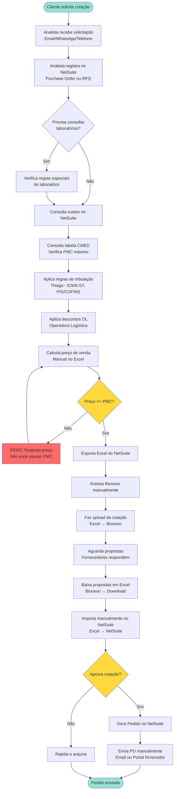
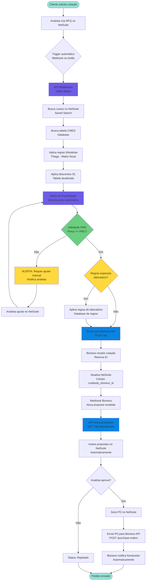
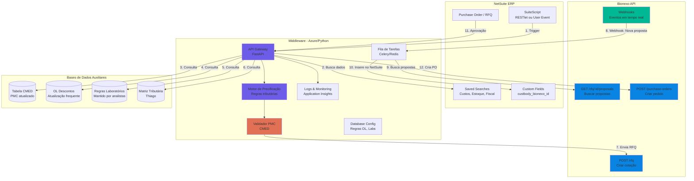
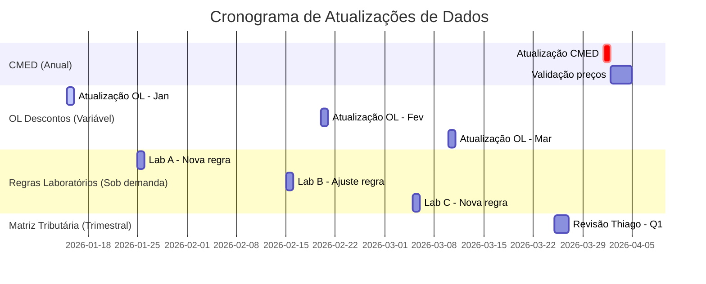
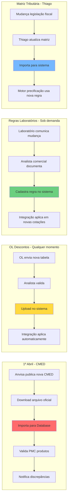
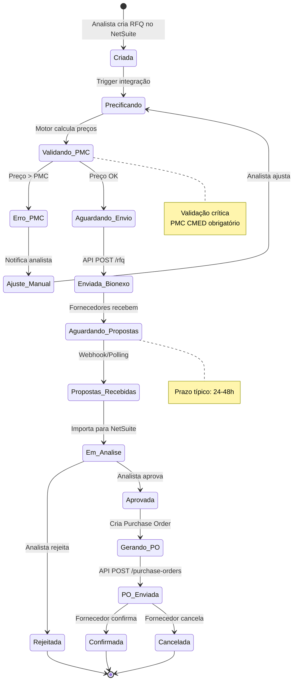
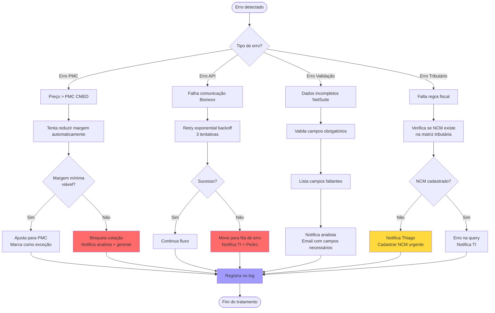
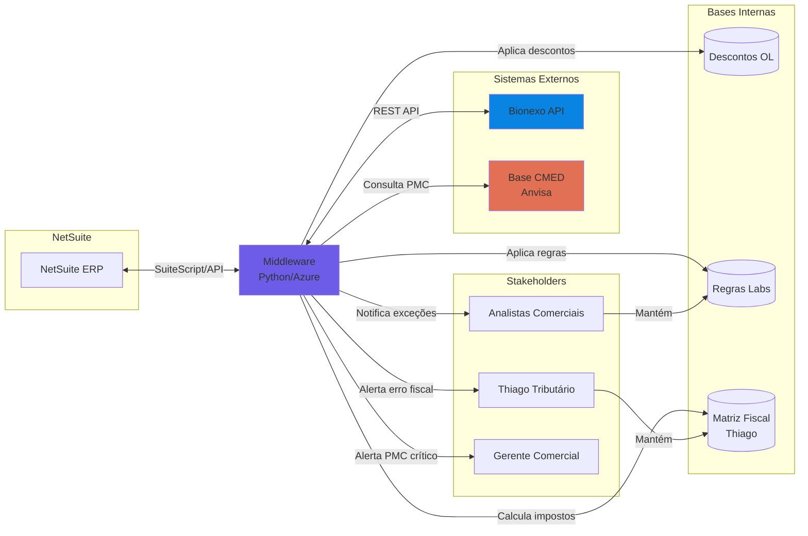

# Diagramas e Fluxogramas - Integração Bionexo x NetSuite

**Data:** 2026-01-29
**Responsável:** Pedro (Inteligência Comercial)

---

## 1. FLUXO ATUAL (AS-IS) - Processo Manual



### Pontos de Dor Identificados

| Etapa | Tempo | Problema |
|-------|-------|----------|
| Registro manual (A→B) | 10 min | Risco de erro de digitação |
| Consulta regras (D→H) | 30 min | Informação dispersa, pode estar desatualizada |
| Cálculo manual (I) | 20 min | Erros de fórmula, validação PMC manual |
| Upload/Download (L→Q) | 40 min | Trabalho repetitivo, propenso a erros |
| Envio PO (U) | 10 min | Manual por fornecedor |
| **TOTAL** | **~2h** | **Alto risco de erro + não escalável** |

---

## 2. FLUXO AUTOMATIZADO (TO-BE) - Com Integração API



### Ganhos Esperados

| Métrica | Antes | Depois | Melhoria |
|---------|-------|--------|----------|
| Tempo por cotação | 2h | 15 min | **87.5% ⬇️** |
| Taxa de erro | ~5% | <0.1% | **98% ⬇️** |
| Validação PMC | Manual | Automática | **100% cobertura** |
| Capacidade | ~10 cotações/dia | ~40 cotações/dia | **4x ⬆️** |
| Rastreabilidade | Baixa | Alta (logs) | **100% auditável** |

---

## 3. ARQUITETURA DE INTEGRAÇÃO



### Decisões de Arquitetura

**Middleware (Recomendado):**
- **Onde:** Azure App Service ou Azure Functions
- **Linguagem:** Python (FastAPI)
- **Vantagens:**
  - Desacopla NetSuite da Bionexo
  - Facilita manutenção de regras complexas (CMED, OL, tributação)
  - Permite retry e fila de tarefas
  - Logs centralizados

**Alternativa - Direto no NetSuite:**
- **SuiteScript RESTlet** chama Bionexo diretamente
- **Vantagens:** Menos infraestrutura
- **Desvantagens:** Regras de precificação complexas ficam no SuiteScript (difícil manter)

---

## 4. FLUXO DE PRECIFICAÇÃO (Detalhado)

```mermaid
flowchart TD
    Start([Item da cotação]) --> A[Busca custo médio<br/>NetSuite: Saved Search]

    A --> B[Busca NCM do produto<br/>NetSuite: Item Master]
    B --> C[Consulta UF destino<br/>NetSuite: Customer]

    C --> D[Busca Matriz Tributária<br/>Database Thiago<br/>NCM + UF]
    D --> E[Calcula ICMS-ST<br/>MVA ajustado]
    E --> F[Calcula PIS/COFINS<br/>Monofásico ou normal]

    F --> G{Produto tem<br/>regra especial<br/>laboratório?}

    G -->|Sim| H[Busca regra do laboratório<br/>Database analistas]
    G -->|Não| I[Aplica margem padrão<br/>Configurável]

    H --> J[Aplica regra especial<br/>Desconto ou markup]
    J --> K[Consulta descontos OL<br/>Database OL atualizada]
    I --> K

    K --> L[Calcula preço base<br/>Custo + Tributos + Margem]
    L --> M[Aplica desconto OL]

    M --> N[Consulta PMC<br/>Tabela CMED<br/>EAN + Data vigência]

    N --> O{Preço calculado<br/><= PMC?}

    O -->|Sim| P[Preço VÁLIDO<br/>Retorna valor]
    O -->|Não| Q[ALERTA PMC<br/>Reduz margem automaticamente]

    Q --> R{Margem mínima<br/>ainda viável?}
    R -->|Sim| S[Ajusta para PMC<br/>Marca como "margem reduzida"]
    R -->|Não| T[ERRO CRÍTICO<br/>Requer intervenção manual]

    S --> P
    T --> U[Notifica analista<br/>Email + Dashboard]

    P --> End([Preço final calculado])
    U --> End

    style O fill:#ffd93d
    style T fill:#ff6b6b
    style P fill:#00b894
    style N fill:#fdcb6e
    style D fill:#74b9ff
```

### Fórmulas de Precificação

**1. Cálculo ICMS-ST:**
```
Base_ST = Custo × (1 + MVA_Ajustada)
ICMS_Proprio = Custo × Aliq_Origem
ICMS_ST = (Base_ST × Aliq_Destino) - ICMS_Proprio
```

**2. Cálculo PIS/COFINS:**
```
Se monofásico:
    PIS_COFINS = 0 (já pago na origem)
Senão:
    PIS = Preço × 0.0165
    COFINS = Preço × 0.076
```

**3. Preço Final:**
```
Custo_Total = Custo + ICMS_ST + PIS + COFINS
Preço_Base = Custo_Total × (1 + Margem)
Preço_Com_Desconto_OL = Preço_Base × (1 - Desconto_OL)

SE Preço_Com_Desconto_OL > PMC:
    Preço_Final = PMC (ajusta na margem)
SENÃO:
    Preço_Final = Preço_Com_Desconto_OL
```

---

## 5. FLUXO DE ATUALIZAÇÕES DE TABELAS



### Processo de Atualização



---

## 6. DIAGRAMA DE ESTADOS - Ciclo de Vida da Cotação



---

## 7. FLUXO DE EXCEÇÕES E ERROS



---

## 8. INTEGRAÇÕES E DEPENDÊNCIAS



---

## NOTAS IMPORTANTES

### Regras de Negócio Críticas

1. **PMC CMED (Preço Máximo ao Consumidor)**
   - Atualizado todo **1º de abril**
   - Limite regulatório - **não pode ser ultrapassado**
   - Denúncia à CMED se violado
   - Sistema deve **bloquear automaticamente** preços acima do PMC

2. **Operadoras Logísticas (OL)**
   - Descontos **mudam frequentemente** (sem padrão)
   - Analistas recebem tabelas atualizadas
   - Sistema precisa permitir **atualização fácil** sem deploy

3. **Regras Especiais de Laboratórios**
   - Cada laboratório pode ter regras únicas
   - Mantido pelas **analistas comerciais**
   - Exemplos: desconto progressivo, margem mínima, prazo diferenciado
   - Sistema precisa ser **flexível** para cadastrar novas regras

4. **Matriz Tributária**
   - Mantida por **Thiago**
   - ICMS-ST varia por NCM + UF
   - Mudanças na legislação fiscal devem ser refletidas rapidamente

### Informações que a Bionexo JÁ POSSUI

- ✅ Média de cotações por dia
- ✅ % de conversão (cotações → pedidos)
- ❓ Perguntar se há relatórios/dashboards disponíveis via API

---

**Próximo:** [Dicionário de Dados](06-DICIONARIO-DADOS.md)
