# Diagramas e Fluxogramas - Integração Bionexo x NetSuite

**Data:** 2026-01-30
**Responsável:** Pedro (Inteligência Comercial)
**Atualizado após conversa com Bruna (Comercial)**

---

## ESCOPO DA INTEGRAÇÃO (Atualizado)

```
A integração Bionexo ↔ NetSuite é para que a BIONEXO ENXERGUE
os PREÇOS que estão no NetSuite.

Direção principal: NetSuite → Bionexo (preços)

PROBLEMA ATUAL: Não temos tabela de preços no NetSuite.
AÇÃO NECESSÁRIA: Criar tabela de preços por ESTADO (UF) e por
LABORATÓRIO/FORNECEDOR (4-5 principais) antes de integrar.
```

---

## 1. FLUXO ATUAL (AS-IS) - Sem Tabela de Preços

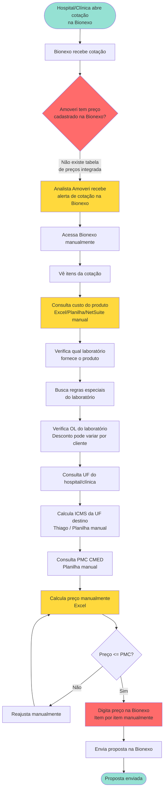

### Pontos de Dor - Processo Atual

| Etapa | Problema | Impacto |
|-------|----------|---------|
| Sem tabela de preços | Não existe precificação estruturada | Impossível automatizar |
| Consulta manual de custos | Informação dispersa | Lento, erro |
| Cálculo manual por UF | ICMS varia por estado | Risco de erro tributário |
| Verificação PMC manual | Planilha CMED | Risco de ultrapassar PMC |
| Digitação na Bionexo | Item por item | Lento, propenso a erros |
| OL por laboratório | Cada lab tem desconto diferente | Complexidade manual |

---

## 2. O QUE PRECISA SER CONSTRUÍDO ANTES DA INTEGRAÇÃO

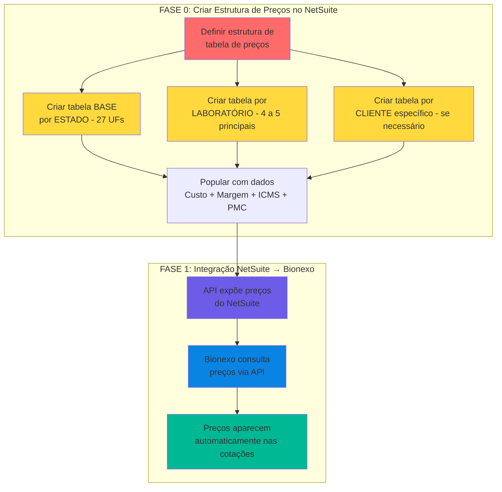

---

## 3. ESTRUTURA DE TABELAS DE PREÇO

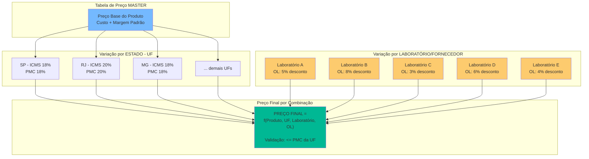

### Lógica de Precificação

```
PREÇO FINAL = Custo Base
              + Margem de Lucro
              + Tributação da UF (ICMS-ST, PIS, COFINS)
              - Desconto OL do Laboratório

VALIDAÇÃO: SE Preço Final > PMC da UF → BLOQUEAR
```

### Dimensões da Tabela de Preço

| Dimensão | Quantidade | Exemplo |
|----------|------------|---------|
| Produtos (SKU/EAN) | [PREENCHER] | Paracetamol 500mg, Amoxicilina 875mg |
| Estados (UF) | Até 27 | SP, RJ, MG, BA, PR, RS, ... |
| Laboratórios/Fornecedores | 4-5 principais | [PREENCHER nomes] |
| OL por Laboratório | Variável | Cada lab pode ter OL diferente |

**Total de combinações possíveis:**
```
N_produtos × N_estados × N_laboratórios

Exemplo: 500 produtos × 27 UFs × 5 labs = 67.500 preços
```

---

## 4. FLUXO AUTOMATIZADO (TO-BE) - Com Tabela de Preços

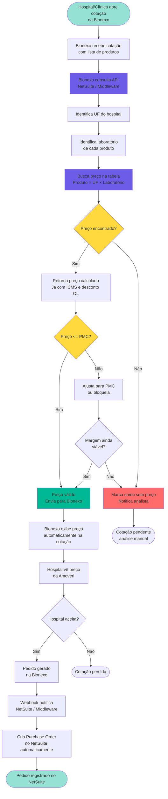

### Ganhos Esperados

| Métrica | Antes (Manual) | Depois (Automatizado) |
|---------|----------------|----------------------|
| Tempo de resposta | Horas/Dias | Segundos (automático) |
| Erros de preço | Frequentes | Zero (validação PMC) |
| Cotações perdidas por demora | Muitas | Mínimas |
| Capacidade | Limitada pela equipe | Ilimitada (API) |
| Consistência de preços | Variável | 100% padronizado |

---

## 5. FLUXO DE CÁLCULO DE PREÇO (Motor de Precificação)

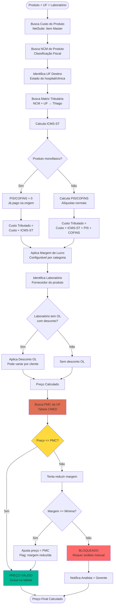

### Fórmula Resumida

```
PREÇO_FINAL(produto, uf, laboratório) =

    Custo_Base(produto)
    + ICMS_ST(ncm, uf_origem, uf_destino)
    + PIS_COFINS(ncm)                         // 0 se monofásico
    × (1 + Margem_Lucro)
    × (1 - Desconto_OL(laboratório))

    VALIDAÇÃO: MIN(Preço_Calculado, PMC(ean, uf))
```

---

## 6. ESTRUTURA DE TABELA DE PREÇOS NO NETSUITE

### Opções de Implementação no NetSuite

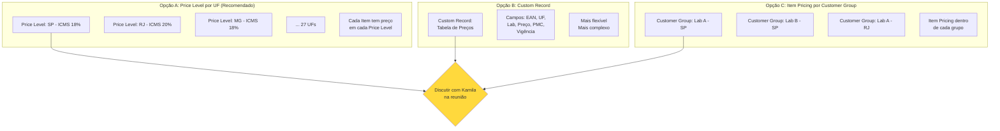

### Opção A: Price Level (Nativo NetSuite)

**Vantagens:**
- Funcionalidade nativa do NetSuite
- Kamila provavelmente já conhece
- Fácil de consultar via SuiteScript/API

**Estrutura:**
```
Price Levels:
├── PRECO_SP (ICMS 18%)
├── PRECO_RJ (ICMS 20%)
├── PRECO_MG (ICMS 18%)
├── PRECO_BA (ICMS 18%)
├── PRECO_PR (ICMS 18%)
├── PRECO_RS (ICMS 17%)
└── ... (27 UFs)

Cada Item:
├── Base Price: R$ 50,00
├── PRECO_SP: R$ 58,50
├── PRECO_RJ: R$ 60,00
├── PRECO_MG: R$ 58,50
└── ...
```

**Limitação:** Não diferencia por laboratório diretamente

### Opção B: Custom Record (Mais Flexível)

**Estrutura:**
```
Custom Record: "Tabela de Preços Bionexo"
├── Item (EAN)
├── UF Destino
├── Laboratório/Fornecedor
├── Preço Calculado
├── PMC da UF
├── Desconto OL aplicado
├── Margem aplicada
├── Data vigência
└── Status (ativo/inativo)
```

**Vantagens:**
- Pode ter preço por Produto × UF × Laboratório
- Flexível para regras complexas
- Pode incluir histórico de preços

### Opção C: Middleware com Database Própria

**Estrutura:**
```
Database Middleware (Python/Azure):
├── Tabela: precos_por_uf
├── Tabela: descontos_ol_por_laboratorio
├── Tabela: pmc_cmed
├── Motor de cálculo
└── API para Bionexo consultar
```

**Vantagens:**
- Total controle
- Performance (cache)
- Independente do NetSuite

**Discussão para reunião com Kamila:** Qual opção se encaixa melhor?

---

## 7. FLUXO DE ATUALIZAÇÃO DE PREÇOS

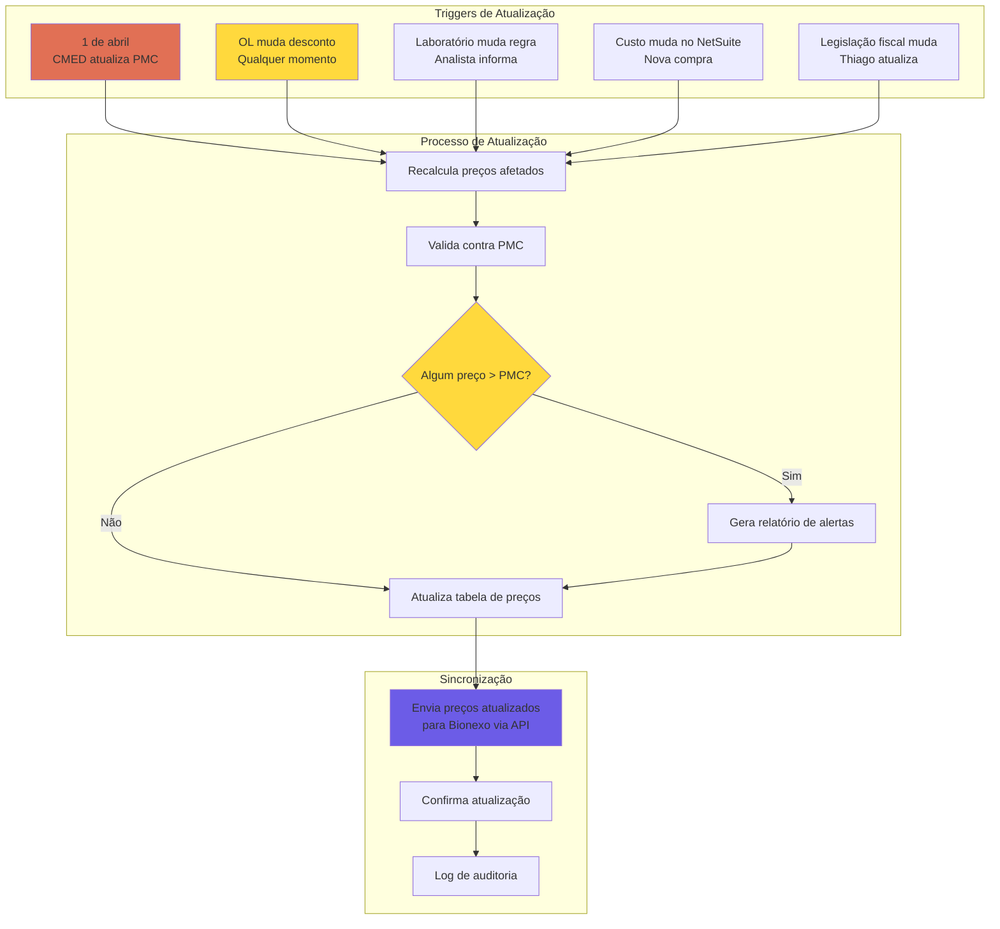

### Frequência de Atualização

| Evento | Frequência | Impacto | Ação |
|--------|------------|---------|------|
| CMED (PMC) | Anual (1º abril) | Todos os preços | Recalcular TUDO |
| OL Desconto | Sem padrão (frequente) | Preços do laboratório | Recalcular lab afetado |
| Regra Laboratório | Sob demanda | Preços do laboratório | Recalcular lab afetado |
| Custo produto | A cada compra | Produto específico | Recalcular produto |
| Legislação fiscal | Quando muda | UF afetada | Recalcular UF |

---

## 8. ARQUITETURA DE INTEGRAÇÃO (Atualizada)

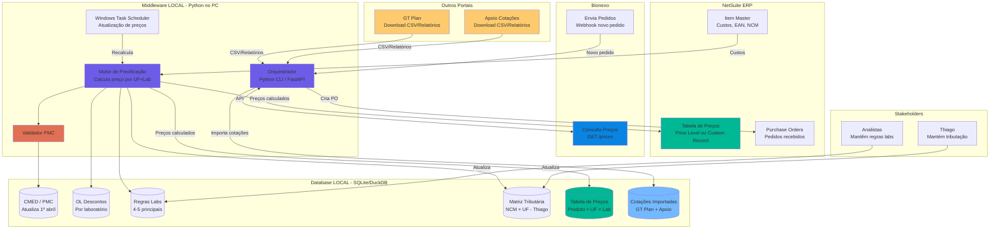

### Fluxo Resumido

```
1. Motor de Precificação calcula preços
   INPUT: Custo (NetSuite) + ICMS (Thiago) + OL (Labs) + PMC (CMED)
   OUTPUT: Tabela de Preços (Produto × UF × Laboratório)

2. Tabela fica disponível via API

3. Bionexo consulta preços via API
   REQUEST: GET /prices?ean=789123&uf=SP&lab=ABC
   RESPONSE: { preco: 58.50, pmc: 62.00, valido: true }

4. Hospital vê preço automaticamente na cotação

5. Se hospital aceita → Pedido volta para NetSuite via webhook
```

---

## 9. DIAGRAMA DE ESTADOS - Tabela de Preços

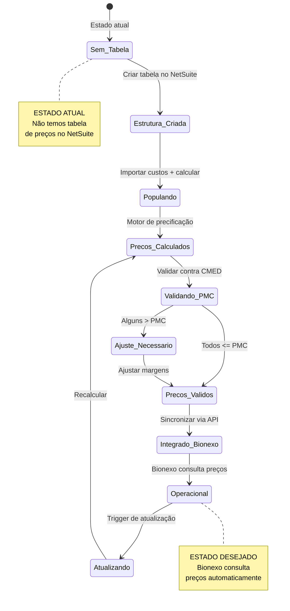

---

## 10. FLUXO DE EXCEÇÕES

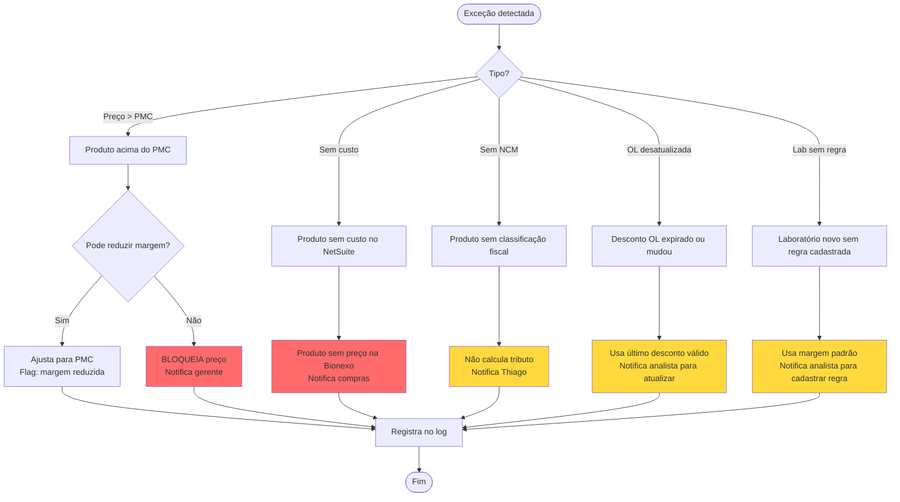

---

## 11. EXEMPLO PRÁTICO - Cálculo de Preço

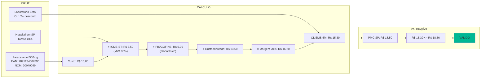

---

## 12. VISÃO GERAL DO PROJETO (Fases)

```mermaid
flowchart LR
    subgraph "FASE 0 - Reunião"
        F0A[Kickoff Bionexo]
        F0B[Coletar inputs<br/>Bruna/Kamila/Thiago]
    end

    subgraph "FASE 1 - Tabela Preços"
        F1A[Criar tabela no NetSuite]
        F1B[Montar matriz tributária]
        F1C[Popular e validar PMC]
    end

    subgraph "FASE 2 - Middleware Local"
        F2A[Python + SQLite no PC]
        F2B[Motor de precificação]
        F2C[Task Scheduler]
    end

    subgraph "FASE 3 - Bionexo"
        F3A[Integrar API Bionexo]
        F3B[Piloto 10-20 produtos]
        F3C[Produção]
    end

    subgraph "FASE 4 - Multi-plataforma"
        F4A[Importar GT Plan]
        F4B[Importar Apoio Cotações]
        F4C[Base consolidada]
    end

    subgraph "FASE 5 - Analytics"
        F5A[Dashboards Power BI]
        F5B[Relatórios automáticos]
    end

    F0A --> F0B --> F1A --> F1B --> F1C --> F2A --> F2B --> F2C --> F3A --> F3B --> F3C
    F2C --> F4A --> F4B --> F4C
    F4C --> F5A --> F5B

    style F0A fill:#74b9ff
    style F1A fill:#ff6b6b
    style F1B fill:#ff6b6b
    style F1C fill:#ff6b6b
    style F2A fill:#6c5ce7
    style F3A fill:#0984e3
    style F4A fill:#fdcb6e
    style F5A fill:#00b894
```

### Resumo das Fases

| Fase | O que | Dependência | Responsável |
|------|-------|-------------|-------------|
| **FASE 0** | Reunião kickoff + coletar inputs | Nenhuma | Pedro + Bruna + Kamila |
| **FASE 1** | Criar tabela de preços no NetSuite | Inputs de Thiago (tributação) | Kamila + Pedro + Thiago |
| **FASE 2** | Middleware local (Python + SQLite) | Fase 1 completa | Pedro |
| **FASE 3** | Integração API Bionexo | Fase 2 completa | Pedro + Bionexo |
| **FASE 4** | Importar dados GT Plan + Apoio | Fase 2 completa | Pedro |
| **FASE 5** | Dashboards e analytics | Fase 4 completa | Pedro |

---

## NOTAS IMPORTANTES

### Mudança de Escopo (30/01/2026)

**Escopo ANTERIOR (incorreto):**
- Integração bidirecional de cotações
- NetSuite ↔ Bionexo (enviar e receber cotações)

**Escopo CORRETO (após conversa com Bruna):**
- Bionexo precisa ENXERGAR os PREÇOS do NetSuite
- Direção principal: **NetSuite → Bionexo (preços)**
- Direção secundária: **Bionexo → NetSuite (pedidos aceitos)**

### Pré-requisito Crítico

```
⚠️ NÃO TEMOS TABELA DE PREÇOS NO NETSUITE HOJE!
⚠️ Precisamos CRIAR essa estrutura ANTES de integrar
⚠️ A tabela precisa ter dimensão: Produto × UF × Laboratório
⚠️ Cada combinação tem preço diferente por causa de ICMS e OL
```

### Informações que a Bionexo JÁ POSSUI

- ✅ Média de cotações por dia
- ✅ % de conversão (cotações → pedidos)

### Regras de Negócio

1. **PMC CMED:** Preço NUNCA pode ultrapassar. Atualiza todo 1º abril.
2. **OL Descontos:** Muda frequentemente. Cada laboratório tem seu desconto.
3. **4-5 Laboratórios principais:** Cada um pode ter OL e regras diferentes.
4. **ICMS por UF:** Determina PMC aplicável e impacta preço final.
5. **Thiago:** Responsável pela matriz tributária.

---

**Próximo:** [06-DICIONARIO-DADOS.md](06-DICIONARIO-DADOS.md) (Atualizado)
**Última atualização:** 2026-01-30
